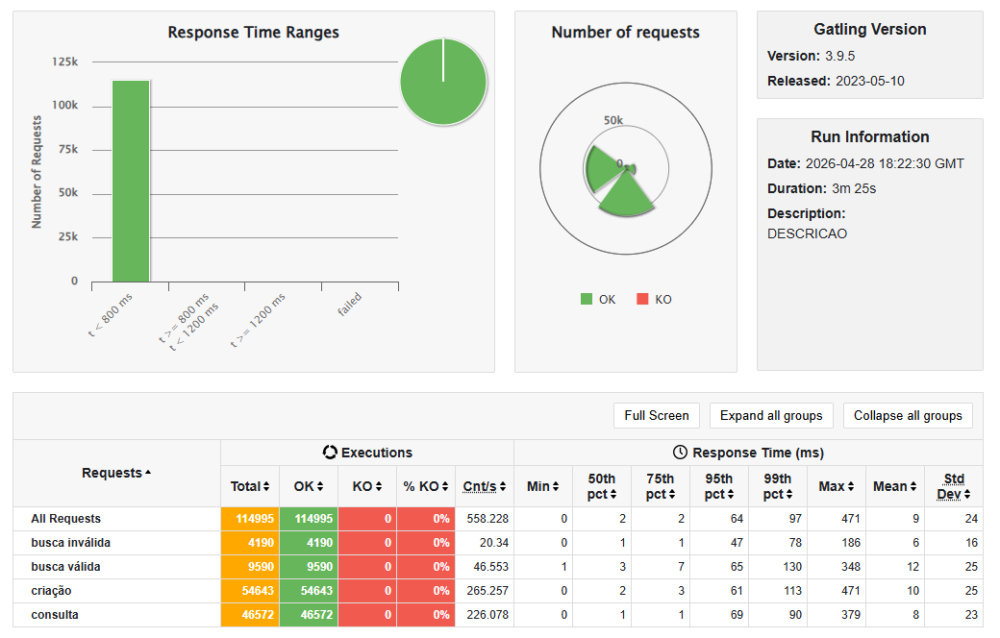

# Rinha Backend 2023 

Desafio original: https://github.com/zanfranceschi/rinha-de-backend-2023-q3?s=08

**Projeto backend feito com Spring-boot 4.0.5 e Java 25 seguindo as regras: https://github.com/zanfranceschi/rinha-de-backend-2023-q3/blob/main/INSTRUCOES.md

### Resutado do teste (46565 INSERTS)

---

#### 💻 Getting started Docker
```SHELL
# Started and attaches to containers for a service
$ docker-compose up --build
```
## Endpoints da API

| Método | Endpoint | Operation ID | Descrição |
|---:|---|---|---|
| POST | `/pessoas` | createPessoa | Cria nova pessoa. Requisição: JSON `PessoaRequest`. Retorna **201** e header `Location: /pessoas/{id}` |
| GET | `/pessoas/{id}` | detalharPessoa | Retorna dados de uma pessoa por UUID |
| GET | `/pessoas?t={termo}` | buscarTermoPessoas | Busca por termo em `nome`, `apelido`, `stack`. Parâmetro `t` obrigatório; retorna lista (máx 50) |
| GET | `/contagem-pessoas` | contar | Retorna número total de registros como texto puro |

#### Códigos de resposta principais
| Código | Significado |
|---:|---|
| 201 | Created (Location header) — `POST /pessoas` quando válido |
| 200 | OK — `GET /pessoas/{id}`, `GET /pessoas?t=...`, `GET /contagem-pessoas` |
| 400 | Bad Request — JSON inválido, parâmetro `t` faltando, conversão de tipos |
| 404 | Not Found — recurso não encontrado |
| 422 | Unprocessable Content — validação falhou, apelido duplicado, violação de integridade |
| 500 | Erro genérico (tratado como 400 pelo `GlobalExceptionHandler` em alguns casos) |

---

#### Banco de dados
- **PostgreSQL** (driver `org.postgresql:postgresql 42.7.10`)
- Migrações com **Flyway** (`V1__init.sql` cria tabela `pessoas` e função `generate_searchable`)
- HikariCP: `SPRING_DATASOURCE_HIKARI_MAXIMUM_POOL_SIZE` padrão **40**

